# Query-Product Relevance Classification in Amazon Search using NLP: A Comparative Study of Traditional ML and Deep Learning Approaches
### NLP Case Study (CA-3) | MTech AI/ML | Symbiosis Institute of Technology, Pune
**PRN:** 25070149025 &nbsp;|&nbsp; **Faculty:** Dr. Aniket Shahade

---

## 📌 Problem Statement

E-commerce search engines must determine how relevant a product is to a user's search query. This project addresses that problem as a **multi-class text classification** task using the Amazon ESCI dataset.

Given a pair `(search query, product title)`, the goal is to classify the relevance into one of four categories:

| Label | Full Name | Description |
|-------|-----------|-------------|
| **E** | Exact | Product directly matches the query |
| **S** | Substitute | Similar product, not exactly what was searched |
| **C** | Complement | Related accessory or complementary item |
| **I** | Irrelevant | No meaningful relationship to the query |

**Real-world relevance:** This task directly powers search ranking, ad targeting, and recommendation systems at companies like Amazon, Flipkart, and Myntra. A misclassified relevance label means the wrong product gets shown — directly impacting conversion rates.

---

## 📂 Dataset

**Amazon Shopping Queries Dataset (ESCI)**
- Released by Amazon Science ([github.com/amazon-science/esci-data](https://github.com/amazon-science/esci-data))
- Contains real customer search queries paired with product listings annotated by human judges
- **20,000 samples** used (5,000 per class, stratified) from the English (US) locale
- **Train / Test split:** 80% / 20% (16,000 train, 4,000 test)
- Loaded via HuggingFace: `tasksource/esci`

### Dataset Statistics

| Class | Train | Test |
|-------|-------|------|
| Exact (E) | 4,000 | 1,000 |
| Substitute (S) | 4,000 | 1,000 |
| Complement (C) | 4,000 | 1,000 |
| Irrelevant (I) | 4,000 | 1,000 |
| **Total** | **16,000** | **4,000** |

### Sample Examples

| Query | Product Title | Label |
|-------|--------------|-------|
| `revent 80 cfm` | Panasonic FV-20VQ3 WhisperCeiling 190 CFM Fan | Irrelevant |
| `iphone 13 case` | Spigen Ultra Hybrid Case for iPhone 13 | Exact |
| `laptop stand` | USB-C Hub 7-in-1 Multiport Adapter | Substitute |
| `coffee maker` | Coffee Filters Size 4 Cone | Complement |

---

## 🗂️ Project Structure

```
query-product-relevance-classification/
├── data/
│   └── README.md                        # Download instructions
├── src/
│   ├── preprocessing/
│   │   └── preprocess.py                # Cleaning, tokenization, TF-IDF
│   ├── models/
│   │   ├── naive_bayes.py               # Model 1
│   │   ├── logistic_regression.py       # Model 2
│   │   ├── svm.py                       # Model 3
│   │   ├── bilstm.py                    # Model 4
│   │   └── distilbert.py               # Model 5
│   └── evaluation/
│       └── evaluate.py                  # Metrics, plots, reports
├── outputs/
│   ├── figures/                         # All plots (committed to GitHub)
│   └── reports/                         # Classification reports as CSV
├── notebooks/
│   └── EDA.ipynb                        # Exploratory Data Analysis
│   └── ESCI_Classification_Colab.ipynb  # Colab notebook (full pipeline)
├── main.py                              # CLI runner
├── requirements.txt
└── README.md
```

---

## ⚙️ Setup & Usage

### Local

```bash
git clone https://github.com/tp-0604/query-product-relevance-classification.git
cd query-product-relevance-classification
pip install -r requirements.txt

# Run full pipeline
python main.py --sample 20000

# Run a single model
python main.py --model distilbert --sample 20000
```

### Google Colab

Open `ESCI_Classification_Colab.ipynb` directly in Colab. The notebook:
- Streams the dataset from HuggingFace (no manual upload needed)
- Runs all 5 models end to end
- Saves all figures and reports to `outputs/`
- Pushes results to GitHub via PAT

> ⚠️ Enable GPU before running: **Runtime → Change runtime type → T4 GPU**

---

## 🔧 Data Preprocessing

The following preprocessing steps are applied to both `query` and `product_title` before model training:

1. **Lowercasing** — normalize case
2. **HTML tag removal** — strip any markup artifacts
3. **URL removal** — remove web links
4. **Special character removal** — keep only alphanumeric and whitespace
5. **Whitespace normalization** — collapse multiple spaces
6. **Stop-word removal** — using NLTK English stopwords
7. **Tokenization** — word-level via NLTK `word_tokenize`

For classical ML models (NB, LR, SVM), the cleaned query and title are **concatenated** into a single string and converted to **TF-IDF features** (unigrams + bigrams, max 20,000 features, sublinear TF scaling).

For deep models, query and title are kept **separate**:
- BiLSTM: concatenated as one sequence
- DistilBERT: encoded as a sentence pair `[CLS] query [SEP] product_title [SEP]`

---

## 🤖 Models

### Model 1 — Naive Bayes
- **Type:** Classical ML
- **Features:** TF-IDF (20k features, bigrams)
- **Algorithm:** Multinomial Naive Bayes with Laplace smoothing (α=0.1)
- **Rationale:** Probabilistic baseline; fast and interpretable but assumes feature independence

### Model 2 — Logistic Regression
- **Type:** Classical ML
- **Features:** TF-IDF (20k features, bigrams)
- **Algorithm:** Multinomial LR with L2 regularization (C=1.0), LBFGS solver
- **Rationale:** Strong linear baseline with better calibration than Naive Bayes

### Model 3 — SVM (LinearSVC)
- **Type:** Classical ML
- **Features:** TF-IDF (20k features, bigrams)
- **Algorithm:** LinearSVC wrapped in CalibratedClassifierCV (C=1.0)
- **Rationale:** Margin-based classifier; generally best-performing classical method for text

### Model 4 — BiLSTM
- **Type:** Deep Learning
- **Embeddings:** Random initialization (100-dim); GloVe-compatible if path provided
- **Architecture:** Embedding → 2-layer BiLSTM (128 hidden) → Dropout(0.3) → FC(4)
- **Training:** Adam, LR=1e-3, ReduceLROnPlateau, gradient clipping, 5 epochs
- **Rationale:** Captures sequential context and word order — something TF-IDF cannot

### Model 5 — DistilBERT (fine-tuned)
- **Type:** Transformer
- **Base model:** `distilbert-base-uncased` (HuggingFace)
- **Input:** `[CLS] query [SEP] product_title [SEP]` — the [SEP] token explicitly encodes the query-product relationship
- **Training:** AdamW, LR=2e-5, linear warmup (10%), 3 epochs, batch size 64
- **Rationale:** Pretrained contextual representations; [SEP] pair encoding directly models cross-sequence relevance

---

## 📊 Results

### Overall Performance

| Model | Accuracy | Precision | Recall | F1 (weighted) | F1 (macro) |
|-------|----------|-----------|--------|---------------|------------|
| Naive Bayes | 0.6628 | 0.6606 | 0.6628 | 0.6573 | 0.6573 |
| Logistic Regression | 0.6933 | 0.6941 | 0.6933 | 0.6895 | 0.6895 |
| BiLSTM | 0.7058 | 0.7068 | 0.7058 | 0.7012 | 0.7012 |
| SVM | 0.7085 | 0.7095 | 0.7085 | 0.7061 | 0.7061 |
| **DistilBERT** | **0.7090** | **0.7120** | **0.7090** | **0.7092** | **0.7092** |

### Per-Class F1 Score

| Model | Exact (E) | Substitute (S) | Complement (C) | Irrelevant (I) |
|-------|-----------|----------------|----------------|----------------|
| Naive Bayes | 0.6424 | 0.4941 | 0.8717 | 0.6211 |
| Logistic Regression | 0.6746 | 0.5367 | 0.8869 | 0.6598 |
| SVM | 0.6851 | 0.5562 | **0.9041** | 0.6791 |
| BiLSTM | 0.6969 | 0.5382 | 0.8857 | 0.6838 |
| DistilBERT | 0.7057 | **0.5817** | 0.8326 | **0.7168** |

### Key Observations

**Complement class is easiest (~0.87–0.90 F1 across all models)**
Products that are accessories or related items tend to use distinctly different vocabulary from the query (e.g., query: "coffee maker" → product: "coffee filters"), making them lexically distinguishable even for Naive Bayes.

**Substitute class is hardest (~0.49–0.58 F1 across all models)**
Substitutes are semantically similar to exact matches but are not what the user searched for. The textual overlap is high, making this the most challenging distinction even for transformers.

**SVM vs DistilBERT are nearly identical overall (0.7061 vs 0.7092 F1)**
The most surprising finding. On 20k samples, DistilBERT's advantage over a well-tuned SVM is marginal (~0.3%). Transformer models typically need more data to significantly outperform classical methods.

**DistilBERT leads on Substitute and Irrelevant classes**
The [SEP] pair encoding gives DistilBERT an edge on ambiguous classes where cross-sequence reasoning matters. SVM leads on Complement because the lexical gap is already sufficient for a linear classifier.

**BiLSTM underperforms SVM despite being a deeper model**
Without pretrained embeddings (GloVe was not used), the BiLSTM initializes randomly and likely converges to a suboptimal representation in 5 epochs. With GloVe.6B embeddings, BiLSTM performance would likely improve by 2–4%.

---

## 📈 Figures

### EDA
| Class Distribution | Text Lengths |
|---|---|
| 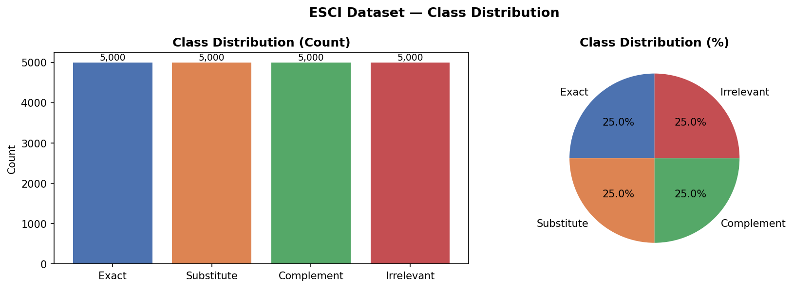 | 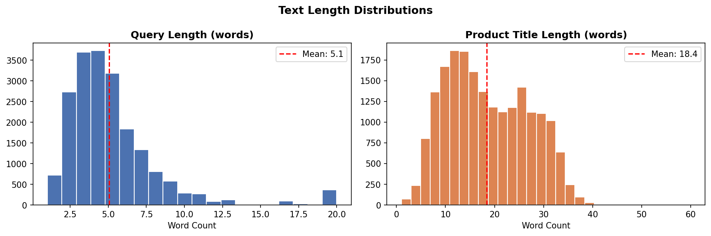 |

| Query Length by Class | Top Query Terms |
|---|---|
| 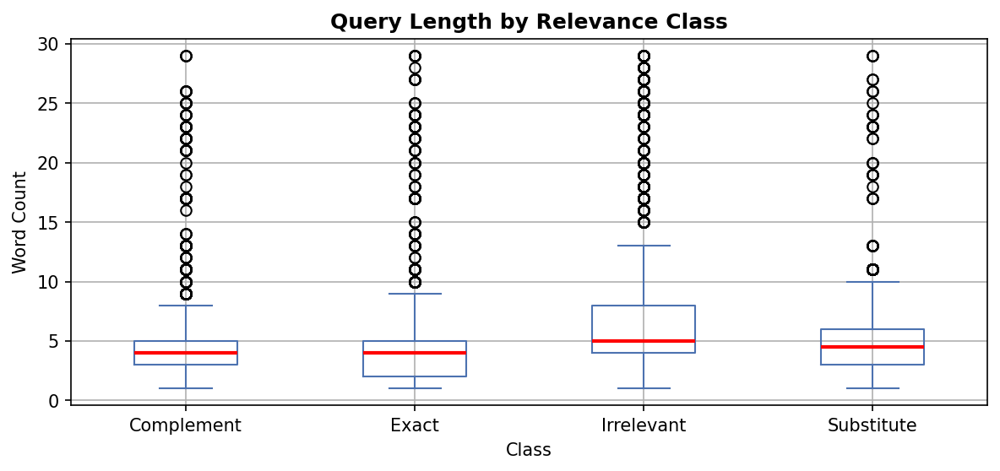 | 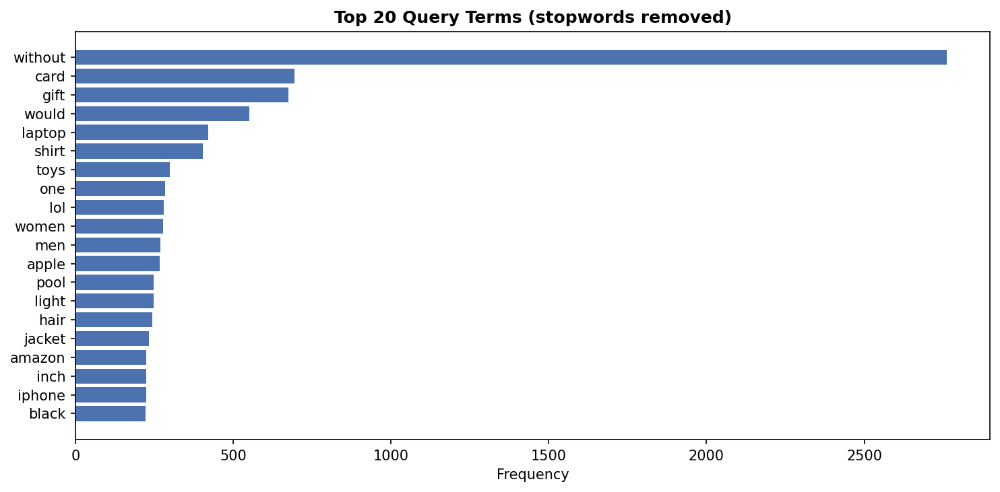 |

### Comparative Analysis
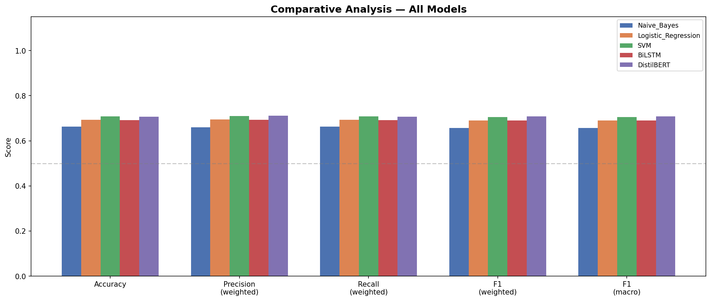
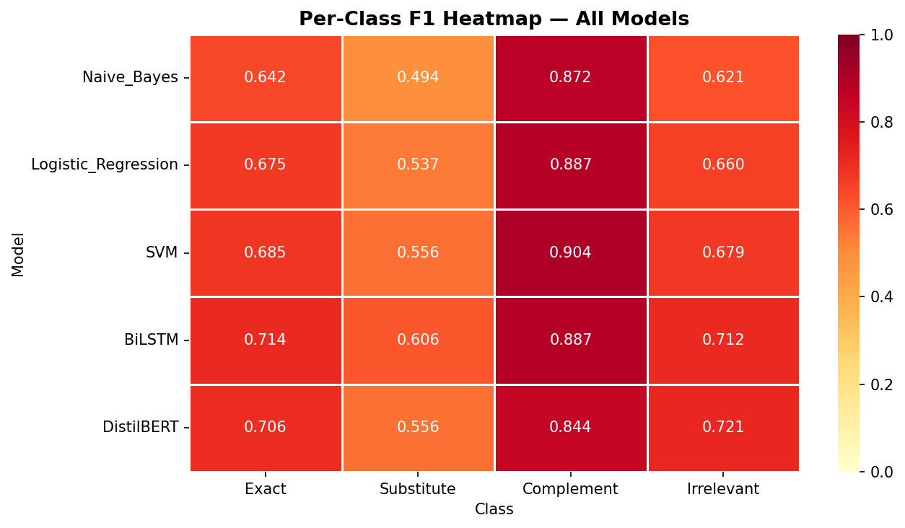

### Confusion Matrices
| Naive Bayes | |
|---|---|
| 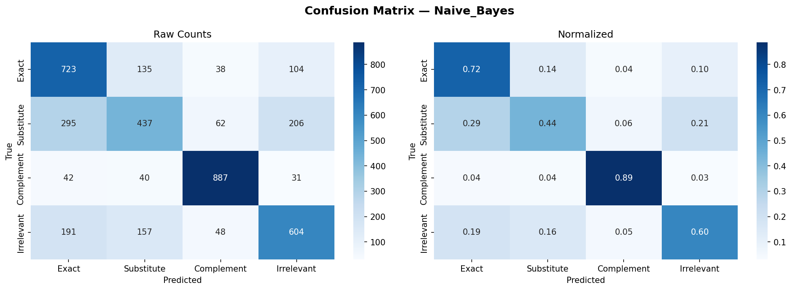 | |

| Logistic Regression | |
|---|---|
| 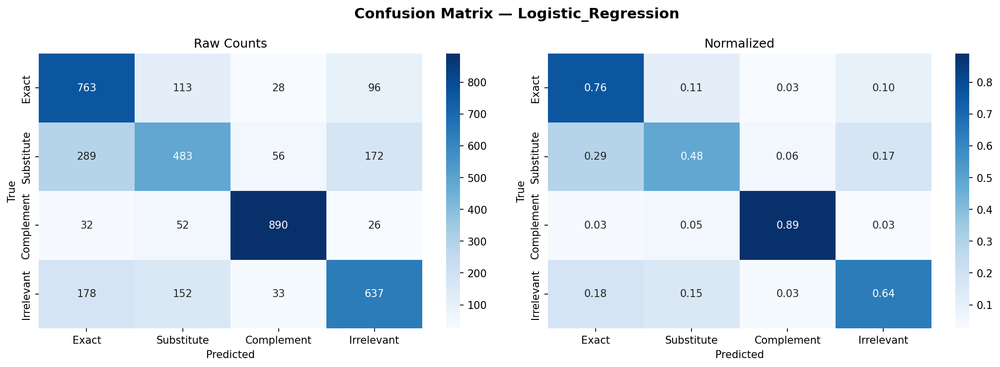 | |

| SVM | |
|---|---|
| 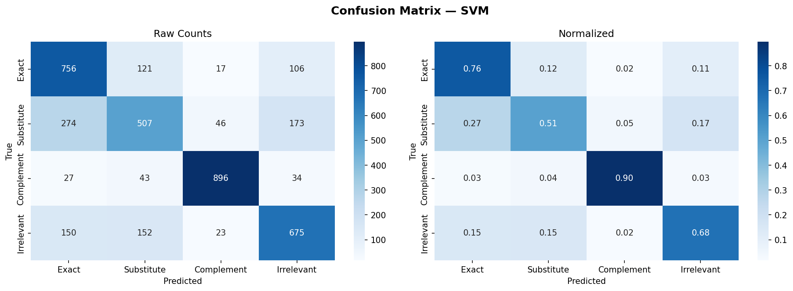 | |

| BiLSTM | |
|---|---|
| 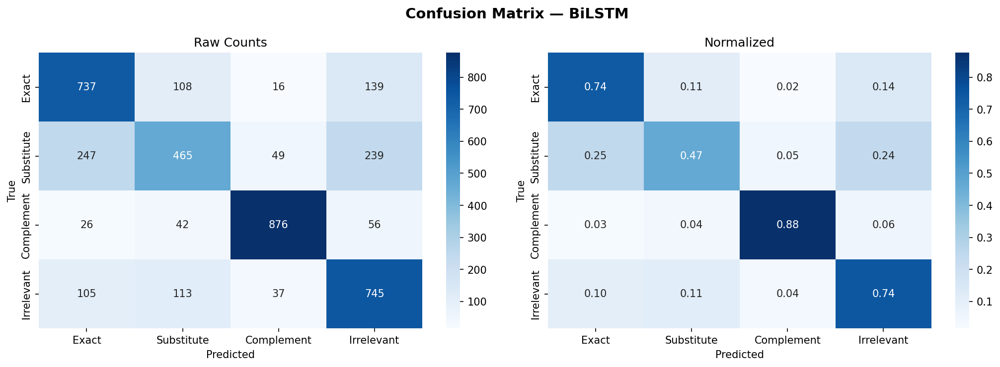 | |

| DistilBERT | |
|---|---|
| 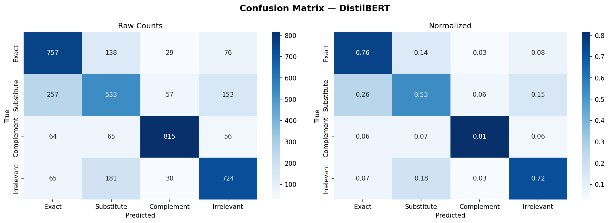 | |

---

## 📁 Reports

All classification reports are available as CSV files in [`outputs/reports/`](outputs/reports/):
- [`comparative_summary.csv`](outputs/reports/comparative_summary.csv)
- [`classification_report_Naive_Bayes.csv`](outputs/reports/classification_report_Naive_Bayes.csv)
- [`classification_report_Logistic_Regression.csv`](outputs/reports/classification_report_Logistic_Regression.csv)
- [`classification_report_SVM.csv`](outputs/reports/classification_report_SVM.csv)
- [`classification_report_BiLSTM.csv`](outputs/reports/classification_report_BiLSTM.csv)
- [`classification_report_DistilBERT.csv`](outputs/reports/classification_report_DistilBERT.csv)

---

## 📚 References

1. Reddy, C. K. et al. (2022). *Shopping Queries Dataset: A Large-Scale ESCI Benchmark for Improving Product Search*. arXiv:2206.06588.
2. Sanh, V. et al. (2019). *DistilBERT, a distilled version of BERT*. arXiv:1910.01108.
3. Hochreiter, S. & Schmidhuber, J. (1997). *Long Short-Term Memory*. Neural Computation, 9(8).
4. Joachims, T. (1998). *Text Categorization with Support Vector Machines*. ECML.

---

## 📄 License

Dataset: [Apache 2.0](https://github.com/amazon-science/esci-data/blob/main/LICENSE) (Amazon Science)  
Code: MIT
